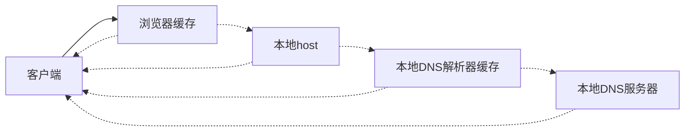
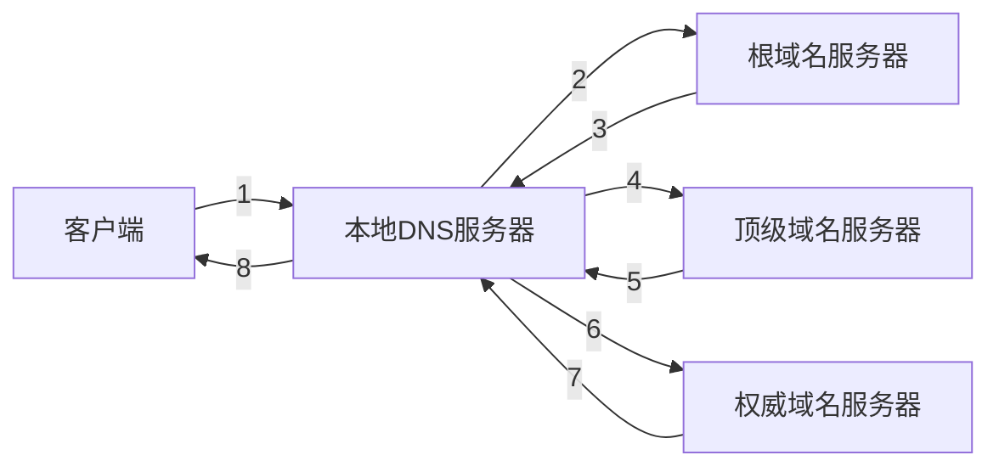

# 域名系统

域名系统(Domain Name System，缩写 DNS)，是将域名与 IP 地址相互映射的分布式数据库  
DNS 运行在应用层上，基于 UDP 协议，默认端口 53

## 域名层级

- 根域名：最高一级的域名节点，管理顶级域名(可在顶级域名后添加 '.'，但一般不写)
- 顶级域名(一级域名)
  - 国际顶级域名：表示注册人类别和功能
    - .com：表示工商企业
    - .net：表示网络提供商
    - .rog：表示非营利组织
  - 国家顶级域名：表示注册地理或国家，个人不能随意申请(如 .cn，)
- 二级域名
  - 国际顶级域名下：注册人指定的域名
  - 国家顶级域名下：表示注册人类别和功能(如 .com.cn)
- 三级域名：作为二级域名的子域名，无需单独申请

一个完整的域名至少包含顶级域名与二级域名

## 域名解析

静态映射：通过本地查询各种缓存或配置进行查询

动态映射：通过本地向其他域名服务器查询

本地服务器查询是递归查询过程；客户端发出一次请求

本地 DNS 服务器向其他域名服务器为迭代查询过程；本地 DNS 服务器发出多次请求

## 负载均衡

通常，具有一定规模的服务由多台服务器组成，DNS 服务器可以循环返回这些 IP 地址从而实现负载均衡

## 为何基于 UDP 协议

UDP 相比 TCP 具有更高的效率

- UDP 无连接，无需三次握手
- 使用 UDP 可以降低服务器开销和网络流量

DNS 解析要求的是快，加上 DNS 服务器网络通常比较稳定，故基于 UDP 具有更好的效率

注意：当报文长度超过 512 字节时，应当转为 TCP 进行传输

- 客户端认为响应包超过 512 字节时，应主动转为 TCP 协议
- 服务端发现相应包超过 512 字节时，在截断 UDP 响应报文中将 TC 设为 1，客户端受到后再次发起一次 TCP 请求
