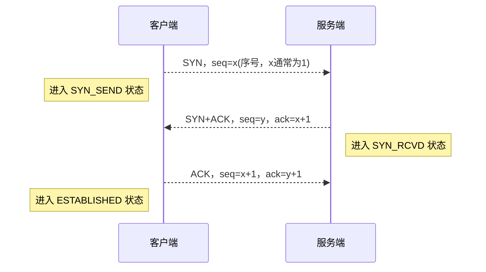
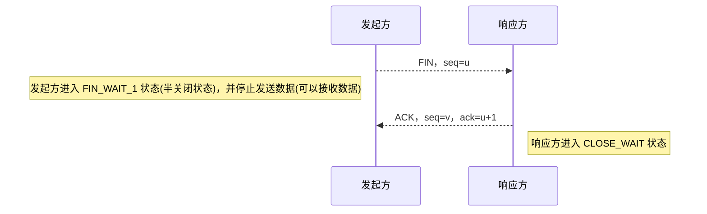

# TCP

## 三次握手

三次握手指客户端与服务端建立 TCP 连接的过程，其目的是确保连接可靠

## 四次挥手

四次挥手指连接的一方主动发起 TCP 连接释放的过程

## 滑动窗口

滑动窗口是一种流量控制技术，用于解决网络拥塞状态下的传输问题 

### 工作流程

窗口机制：在任意时刻，发送方与接收方各维持了一个连续的允许发送或接收帧的序号，称为发送窗口与接收窗口，发送窗口与接收窗口的需靠上下界和大小都可不同。

发送窗口按序号发送帧，发送窗口内若全部帧处于待确认状态则停止发送； 
接收窗口按序号接收帧，接收后发送确认帧并向后滑动窗口 
发送窗口接收到确认信息，从重发表删除对应帧并向后滑动窗口  

### 相关协议

根据滑动窗口尺寸分为以下三种协议

- 停等协议：当发送窗口与接收擦黄口大小固定为 1 时，滑动窗口协议退化为停等协议
  - 发送窗口=1；接收窗口=1
  - 需要不停的等待应答帧，信道利用率低
- 后退 n 协议：发送方会连续发送若干数据帧，并对每个数据帧设置超时定时器，超时后将重发超时帧及后续帧
  - 发送窗口>1；接收窗口=1
  - 重传时需要重传错误帧及后续帧，在误码率较大场景下，传输效率依旧不高
- 选择重传协议：接收方对于错误帧后续的正确帧进行缓存并要求重传错误帧
  - 发送窗口>1；接收窗口>1
  - 减少了重发浪费，具有较高的传输效率，但要求接收方具有足够的缓冲空间

### 窗口大小

TCP 连接阶段，双方协商窗口尺寸同时接收方预留数据缓存区 

## 拥塞控制

网络拥塞是网络中某一资源的需求超过了该资源所能提供的可用部分造成网络性能变差的情况  
TCP 使用多种拥塞控制策略避免雪崩式拥塞

- 为每条连接维护一个 拥塞窗口 限制端到端传输的未确认分组总理
- 在连接初始化或超时后使用 慢启动 机制增加 拥塞窗口 的大小

### 核心概念

拥塞窗口(cwnd)，由发送方维护，用于控制每次发送数据包的大小 
最大分段大小(MSS，IPv4 为 536 字节，IPv6 为 1220 字节)，这里表示拥塞窗口大小的单位 
慢开始门限(ssthresh)，拥塞窗口的最大值  

### 算法流程

1. 慢启动阶段：设置 cwnd 初值为 1/2/4/10 个 MSS，每次接收到确认包时翻倍增加，直至达到 ssthresh 或丢包等。
2. 拥塞避免阶段：采用线增积减(AIMD)的反馈机制控制 cwnd 大小。cwnd 达到 ssthresh 时，若网络良好，每经过一个 RTT，cwnd&ssthresh + 1MSS；若网络拥塞(超时)，则 ssthresh 减半，cwnd 置 1MSS，进入慢开始阶段。
3. 快速重传机制：TCP 在发送报文段时会开启超时计时器，当发送方收到 4 次相同的分段确认(假设重复阈值 3 次)，则认为可能出现丢包状态，发送方忽略超时计时器并立即重发，进入快速恢复阶段
4. 快速恢复阶段：发送方将 cwnd 与 ssthresh 减半，随后进入避免拥塞阶段

## 重传机制

发送端在发送报文段时会开启定时器并保留副本，若发送超时则进行重传直到成功。

### 重传超时时间

由于传输距离与传输负载在传输时的差异，RTO 的设计采用自适应算法以适应不同的网络

建议 RTO = RTT~s~ + 4 × RTT~d~

- RTT~s~: 加权平均往返时间
- RTT~d~: 偏差的加权平均值

### 连接往返时间

RTT
