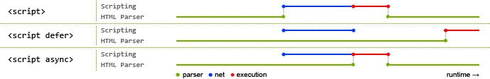

# 工作流程

## 资源请求

1. 获取用户输入的 URL 地址
2. 根据地址请求资源或使用缓存(缓存策略)
   - 未缓存: 发起请求, 获取资源
   - 已缓存: 判断缓存是否过期
     - 未过期: 从缓存中读取资源
     - 已过期: 向服务器请求资源
       - 使用协商缓存: 返回 304 状态码, 使用缓存资源并更新过期时间
       - 使用响应资源: 返回 200 状态码, 使用服务器资源
3. 浏览器解析 URL 地址
4. 浏览器组装 HTTP 请求
5. 浏览器获取主机 IP 地址(DNS 查询)
   1. 查看浏览器缓存
   2. 查看本机缓存
   3. 查看 Host 文件
   4. 查看路由器缓存
   5. 查看 IPS DNS 混村
   6. DNS 递归查询
6. 打开 Socket 与服务器端口建立 TCP 连接(三次握手)
   1. 客户端发送请求包给服务器, 等待服务器确认
   2. 服务器接收到请求包后发送响应包给客户端
   3. 客户端收到响应包后发送确认包给服务器
7. TCP 连接建立后发送 HTTP 请求
8. 服务器接收请求处理后返回响应
9. 浏览器接收 HTTP 响应, 根据情况选择是否断开 TCP 连接(四次挥手)
   1. 客户端发送 FIN 报文给服务器
   2. 服务器接收 FIN 并返回 ACK 报文给客户端
   3. 服务器关闭与客户端的连接并发送 FIN 报文给客户端
   4. 客户端接收 FIN 并发送 ACK 报文给服务器表示确认
10. 浏览器接收响应后判断响应状态码并进行处理
    - 判断资源是否可以缓存并进行相应处理
    - 判断资源是否需要解码并进行相应处理
    - 判断资源是否可以解析并进行相应处理

## 资源解析

- 解析 HTML 和 CSS
  1. HTML 解析为 DOM Tree, CSS 解析为 CSS Rules
  2. 根据 DOM Tree 和 CSS Rules 生成 Render Tree
  3. 对 Render Tree 进行 Layout 和 Painting 并进行页面呈现
  4. 加载异步资源, 如图片、AJAX 请求、预取资源等
- 解析 JS
  - 同步脚本: 加载和执行阶段都会阻止文档解析
    - 内部脚本: 直接执行脚本
    - 外部脚本: 等待资源加载完毕后解析和执行
  - 异步脚本: 加载时不阻止文档解析, 执行时阻止文档解析
    - defer 标记: 延迟加载, 文档解析后, `DOMContentLoaded` 事件之前执行, 有序执行
    - async 标记: 异步加载, 加载完成后立即执行, 无序执行

