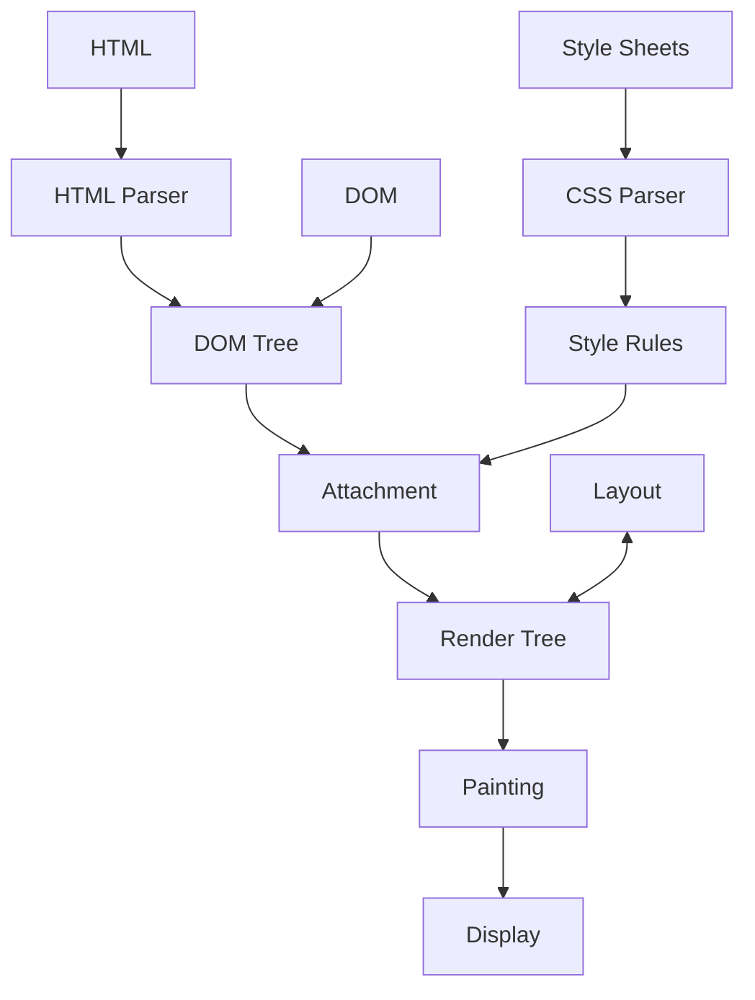
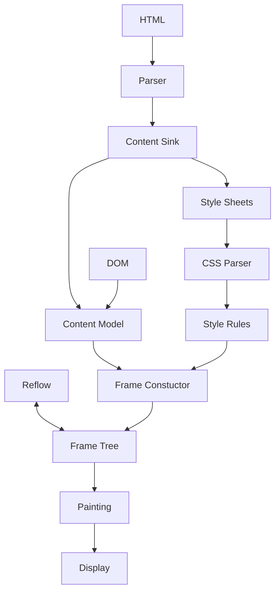

# 渲染引擎

浏览器通过渲染引擎解析并展示请求内容  
主流的渲染引擎为 Webkit(Chrome) 与 Gecko(Firefox)，两者流程相似略有不同  
渲染引擎主要用于处理 HTML 和 XML ，也可通过插件扩展其功能  

## 工作流程

渲染引擎从网络层获取请求文档的内容, 然后渐进的(无需等待全部解析)进行以下流程处理

1. 解析：解析 HTML 为 DOM 树，解析样式数据为样式规则
2. 构建：根据 DOM 树与 样式规则，构建包含视觉属性的渲染树
3. 布局：渲染树布局处理，为每个节点分配坐标信息
4. 绘制：渲染树绘制处理，由用户界面后端层将节点进行绘制

以下为 Webkit 与 Gecko 的主要流程，其使用术语略有不同，但整体流程大体相同。

<h5 style="text-align: center">上图: webkit主流程</h5>

<h5 style="text-align: center">上图: gecko主流程</h5>

## 解析流程

1. 解析：文档 -> 词法分析 -> 语法分析 -> 解析树
2. 翻译：解析树--> 翻译 --> 机器码

Webkit 在实现解析器时使用了用于创建词法分析器的 Flex 和用于创建语法解析器的 Bison

### HTML 解析

HTML 的定义采用 DTD(文档类型定义) 格式，包括所有允许使用的元素及其属性和层次结构的定义，无法构成与上下文无关的语法，因而无法使用常规的自上而下或自下而上的解析器解析

解析树是由 DOM 元素和属性节点构成的树结构；DOM 是文档的对象表示，也是外部内容(如 JS)与 HTML 元素之间的接口

解析算法：标记化和树构建

- 标记化：词法分析过程，将输入内容解析为多个标记
- 构建树：在接收到标记时创建对应的 DOM 元素添加到 DOM 树及开放元素的堆栈中(用于纠正嵌套错误和处理为未关闭标记)

HTML 解析过程中会对错误标签进行纠错，解析结束后，文档进入交互状态，并开始解析 "deferred" 模式的脚本

### CSS 解析

CSS 是上下文无关的语法，使用 Flex 和 Bison 解析器生成器，通过 CSS 语法文件自动生成解析器。

### 脚本处理与样式表顺序

- 脚本 `<script>`
  - 同步脚本: 加载和执行阶段都会阻止文档解析
    - 内部脚本: 直接执行脚本
    - 外部脚本: 等待资源加载完毕后解析和执行
  - 异步脚本: 加载时不阻止文档解析, 执行时阻止文档解析
    - defer 标记: 延迟加载, 文档解析后, `DOMContentLoaded` 事件之前执行, 有序执行
    - async 标记: 异步加载, 加载完成后立即执行, 无序执行
- 预解析
  - 执行脚本时, 其他线程会解析文档的其他内容, 找出并加载需要通过网络加载的其他资源
  - 这里的预解析只会解析外部资源的引用, 不会修改 DOM 树
- 样式表
  - 样式表加载**不阻塞 DOM 树解析**
  - 样式表加载**会阻塞 DOM 树渲染**
  - 样式表加载会**阻塞脚本运行**
  - 样式表解析时对脚本的阻塞(原文说加载和解析过程, 测试发现加载时都会阻塞)
    - Gecko: 样式表在加载和解析时会禁止脚本
    - Webkit: 仅当脚本尝试访问的样式属性可能受未加载的样式表影响时会禁止脚本

## 构建流程

渲染树(Gecko 中称为 框架树)是可视化元素按照其显示顺序组成的树，用于渲染器进行布局和绘制 
渲染树与 DOM 元素是相对的(非一一对应)，非可视化的 DOM 元素不会插入渲染树中(如 `head` 标签的元素，`display: none` 属性的元素)

每一个渲染器都代表一个矩形区域(对应 CSS 盒子)，框的类型受 `display` 属性影响 
部分元素可能具有多个渲染器(如 `select`)

构建

- 创建渲染器/框架
  - Gerko：由 FrameConstructor 构造解析样式并创建框架
  - Webkit：在节点插入 DOM 树时调用 attach 方法
- 处理 html 和 body 标记时会创建渲染树根节点，其尺寸即视口
  - Gerko：ViewPortFrame
  - Webkit：RenderView

样式计算(TODO:)

## 布局流程

文档采用流的布局模型，大多数情况下只需一次遍历即可计算出集合信息(少数情况如表格等) 
文档流中位置靠后的元素通常不会影响位置考前的元素，因此通常布局按照从左往右，从上往下的顺序遍历文档 

dirty 位：避免因细小改动进行整体布局

- 若渲染器变化或将自身及子代标注为 'dirty',则需要进行布局
- `children are ditty`：表示渲染器至少一个子代需要布局

全局布局和增量布局

- 全局布局：触发了整个渲染树的布局
  - 全局样式修改影响了全部的渲染器
  - 屏幕大小调整
- 增量布局：只对 dirty 渲染器进行布局(可能存在需要额外布局的弊端)

异步布局和同步布局

- 增量布局是异步执行的
- 全局布局通常是同步执行的

布局处理

1. 父渲染器确认自身宽度
2. 父渲染器依次处理子渲染器
   i. 放置子渲染器(设置 xy 坐标)
   ii. 调用子渲染器布局，计算子渲染器高度
3. 父渲染器根据子渲染器累加高度以及边距等设置自身高度
4. 将 dirty 位设为 false

## 绘制流程

系统遍历渲染树，并调用渲染器的 `paint` 方法 
绘制工作借助用户界面基础组件完成  
与布局流程一样，绘制流程分为全局绘制和增量绘制  

绘制顺序

1. 背景颜色
2. 背景图片
3. 边框
4. 子代
5. 轮廓

## 动态变化(回流重绘)

当元素发生变化时，浏览器会尽可能做出最小的响应； 
当元素表现样式发生变动时，只触发对应元素的重绘； 
当元素位置或大小变动时，只触发元素及子元素(可能有同级元素)进行布局和重绘； 
全局重大样式变动(如字体、box-sizing 等)导致位置缓存无效，将触发整个渲染树的布局和重绘。 

触发回流的行为

- 页面首次渲染
- 窗口尺寸变动
- 增减可视元素
- 元素尺寸变动
- 元素位置变动
- 元素内容变动
- 元素属性获取

说明：

- 回流、布局 表示 Layout 流程
- 重绘、绘制 表示 Paint 流程
