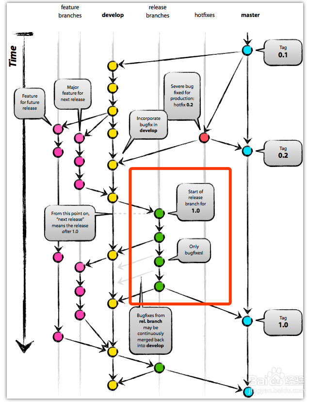

# 基本使用

## 初始配置

本地初始化

```bash
# 将当前目录初始化为 Git 仓库
git init
```

远端 clone

```bash
git clone <server>
```

配置 ssh-key

```bash
# 若目录不存在则 mkdir ~/.ssh/
cd ~/.ssh/
# 查看邮箱名称并进行设置
git config --global --list
git config --global user.name  "名称"
git config --globsl user.email "邮箱"

ssh-keygen -t rsa -C "邮箱"
# 三次回车 (确认 ssh-key 生成地址、密码、确认密码)，这里使用默认地址不设置密码即可
cat ~/.ssh/id_rsa.pub # 复制 ssh-key 配置到远程仓库
ssh -T git@gitee.com # ssh 测试，这里用的码云
```

## 文件提交

```bash
# 将指定文件添加到缓存区
git add <fileName>
# 将所有文件添加到缓存区
git add .
git add *
# 将指定文件从暂存区删除
git rm <filename>
# 将缓存区内发生的变动提交到当前分支
git commit -m "描述信息"
```

## 撤销修改

撤销 add

```bash
# 如果该文件添加到缓存区后又进行了修改，则撤销修改退回至缓存区状态
# 如果该文件修改后未添加到缓存区，则撤销修改退回至版本库状态
git checkout -- <filename>
# 撤销缓存区的修改至版本库状态，这里`HEAD`表示最新版本
git reset HEAD <filename>
```

撤销 commit

```shell
# 查看提交记录引用
git reflog
# 根据引用切换到指定版本
git reset --hard <commit id>
# 回退到上个版本
git reset --hard HEAD
```

## 远端管理

```bash
# 查看远端仓库
git remote
git remote -v
# 查看远程仓库状况，已删除的分支会标注为 `stale` 状态
git remote show origin

# 将本地仓库与远端仓库进行绑定，如果已经绑定则无需执行该操作
git remote add origin <server>
# 将本地仓库推送至远端仓库
git push origin <branch>
```

```bash
# 修改仓库源
git remote set-url origin <new-url>
```

## 分支管理

创建、删除、切换

```bash
# 默认的分支为主分支, 一般为 master，最新的 github/gitlab 创建的仓库为 main
# 创建一个分支
git branch <branch>
# 切换到指定分支
git checkout <branch>
# 创建并切换到指定分支，相当于 git branch <branch> 与 git checkout <branch> 的简写
git checkout -b <branch>
# 查看分支，当前分支会用 '*' 号标记
git branch
# 查看远程分支
git branch -r
# 查看全部分支
git branch -a
# 合并指定分支到当前分支
git merge <branch>
# 合并分支, 该场景可能出现在 remote 发生变动后, 分支的历史源不同
git merge <branch> --allow-unrelated-histories
# 删除指定分支(未合并的分支无法删除)
git branch -d <branch>
# 强制删除指定分支(用于删除未合并的分支，通常用于开发内容被取消而无需合并的分支)
git branch -D <branch>
```

远端分支获取、同步

```bash
# 本地未存在对应远端分支
## 创建本地分支并同步远端分支
git checkout -b <分支名>:origin/<分支名>
## 将远端分支同步到本地
git fetch origin <分支名>:<分支名>

# 本地已存在远端对应分支
## 将远端分支同步到本地
git fetch origin <分支名>
## 将已同步的分支与本地分支合并
git merge FETCH_HEAD
## 将本地分支与远端分支进行同步，相当于 git fetch origin <分支名> 与 git merge FETCH_HEAD 的简写
git pull origin <分支名>

# 远端分支已被删除，本地进行同步
git remote prune origin
```

本地分支推送、同步

```bash
# 推送本地分支到远端，若不存在将自动创建
git push origin <分支名>
# 将删除对应分支的操作推送到远端
git push origin <分支名> --delete
```

## 标签管理

```bash
# 查看标签
git tag
# 设置标签
git tag <tag name>
git tag <tag name> -m <some message>
# 推送标签
git push origin --tag
# 同步标签
git pull origin --tag
# 删除标签
git tag -D <tag-name>
git push origin :refs/tags/<tag-name>
```

## 暂存管理

```bash
# 暂存当前修改内容
git stash save [说明]
# 应用上一个暂存
gti stash pop
# 列出暂存日志
git stash list
# 查看指定的暂存
git stash show stash@{$num}
# 应用指定的暂存
git stash apply stash@{$num}
# 丢弃指定的暂存
git stash drop stash@{$num}
# 清空暂存历史
git stash clear
```

## 仓库状态

```bash
# 查看仓库状态
git status
# 查看改动内容(工作区与缓存区比较)
git diff
# 查看改动内容(缓存区与分支比较)
git diff --cached
# 查看操作日志，无法查看已经删除的 commit 记录(退回时会删除退回版本之后的日志信息)
git log
# 查看日志，格式化后显示
git log --pretty=oneline
# 查看所有分支的所有操作记录(包括被删除的记录)
git reflog
```

## 常用配置

```bash
# 正确展示中文路径
$ git config --global core.quotepath off
# 默认推送远程同名分支
$ git config --global push.default current
```

## 异常处理

```bash
###
fetch-pack: unexpected disconnect while reading sideband packet
fatal: early EOF
fatal: fetch-pack: invalid index-pack output
###

git config --global core.compression 0
```

---

## 基本概念

Git 中的文件会处于以下状态

- 已提交: 表示数据以保存在本地数据库
- 已修改: 表示修改了文件，但未保存至数据库
- 已暂存: 表示对一个已修改文件的当前版本做了标记，使之包含在下次提交的快照中

由此 Git 项目有以下三个工作区域

- Git 仓库: 用于 Git 保存项目元数据和对象数据库
- 工作目录: 项目的某个版本独立提取出来的内容
- 暂存区域: 保存了下次提交的文件列表信息的文件，一般在 Git 仓库目录中

HEAD: 指向当前版本，默认指向最近一次提交后的结果

Git 的基本工作流程

1. 在工作目录中修改文件
2. 暂存文件，将文件的快照放入暂存区域
3. 提交更新，找到暂存区域的文件，将快照存储至 Git 仓库

Git 常用的分支管理


