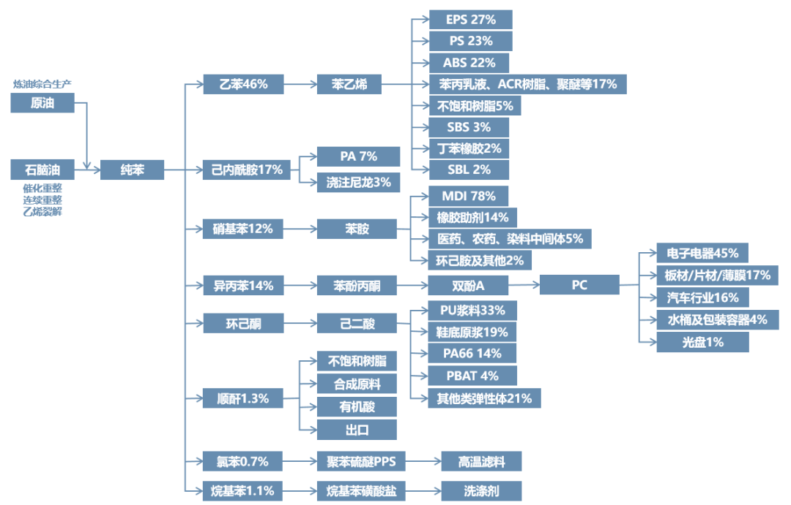

# 能源化工产业链

煤炭石油天然气除了用作能源外，同时是化工原料的重要来源，由于我国能源呈现富煤贫油少气的特点，部分工艺具有独特性。

## 化工产品来源占比

| 原料   | 甲醇 | PE  | PP  | PVC | 苯乙烯 | PTA  | 乙二醇 | 尿素 |
| ------ | ---- | --- | --- | --- | ------ | ---- | ------ | ---- |
| 天然气 | 15%  | -   | -   | -   | -      | -    | -      | 26%  |
| 焦煤   | 12%  | -   | -   | 85% | -      | -    | -      | 3%   |
| 烟煤   | 63%  | 20% | 27% | -   | 20%    | -    | 44%    | 37%  |
| 无烟煤 | 10%  | -   | -   | -   | -      | -    | -      | 34%  |
| 原油   | -    | 76% | 52% | 15% | 80%    | 100% | 48%    | -    |

结合 2013-2021 历史数据来看

- 从原油化工产业链上，化工产品与油价关联紧密度依次为 PTA、苯乙烯 > PE、PP、乙二醇 > 甲醇 > PVC
- 实际原油价格和化工产品的相关系数为：PTA(0.83)、苯乙烯(0.79)、 LLDPE(0.79)、PP(0.93)、乙二醇(0.64)、甲醇(0.77)、PVC(0.43)

::: warning
本数据来源于 2021 年分析报告, 数据仅供参考, 会随时间变动
:::

## 石油化工产业链

原油经炼化装置后可以获得成品油(汽油 20%、柴油 25%-30%、航空煤油 17%-18%)、石脑油(8-9%)等;  
其中石脑油一般作为产业链的中间产品，主要用于生产化工原料；  
由于石脑油占比并不高，因而化工品价格变动对油价影响较小，而油价变动对油头化工品影响较大；  
石脑油经过乙烯装置裂解后得到烯烃和芳烃，其下游重要为合成树脂、合成橡胶、聚酯纤维 等  

## 煤炭化工产业链

我国贫油富煤，煤化工可以在一定程度上减轻石油化工的压力； 
其中煤化工主要产品甲醇可以用于生产乙烯、丙烯

## 主要化工原料

### 乙烯产业链(碳二)

乙烯是全球最大量化学产品，国内存在一定产能缺口，主要用于生产

- 聚乙烯(PE)：产量最大的通用塑料
- 乙二醇(EG)：EG 主要(约 90%)用于与 PTA 合成聚酯纤维(纺织材料)，少数用于防冻液。(注，国内 EG 主要采用草酸酯法，煤头)
- 环氧乙烷：减水剂
- 聚氯乙烯(PVC)：第三大通用塑料，主要用于管材和型材(地产相关)。(注，国内 PVC 主要采用电石法，煤头)

### 丙烯产业链(碳三)

丙烯主要用于生产

- 聚丙烯(PP)：第二大通用塑料，主要用于塑编、包装、日用
- 丙烯腈：主要用于合成 ABS 树脂，其下游为汽车、器具、电子电器
- 环氧丙烷: 中间原料，用于合成聚氨酯泡沫、保温材料、涂料等
- 丙烯酸: 环保漆、胶带、卫生用品

### 碳四产业链

C4 产业链主要用于生产丁基橡胶

### 芳烃产业链

芳烃主要包括苯、甲苯、二甲苯

- 苯：主要用于生产苯乙烯(EB)，EB 主要用于合成聚苯乙烯(PS)和橡胶，其中
- 甲苯：汽油添加剂
- 二甲苯：主要用于生产对二甲苯(PX)，PX 是精对二甲苯(PTA)的原料，PTA 和乙二醇(EG) 用于合成聚酯纤维(涤纶)，是纺织业的原料之一

### 氮肥产业链

## 注意事项

::: warning
本文写于 2023 初, 不同年份行业可能存在变动
:::

## 参考内容

- [化工全产业链框架图](https://cj.sina.com.cn/articles/view/2727739985/a2960251019016olk)
- [化工品与原油联动性分析](https://max.book118.com/html/2021/1203/7001200034004056.shtm)
