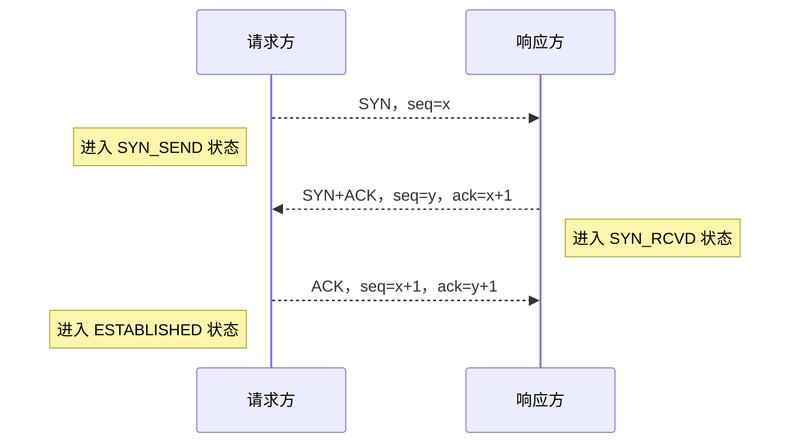
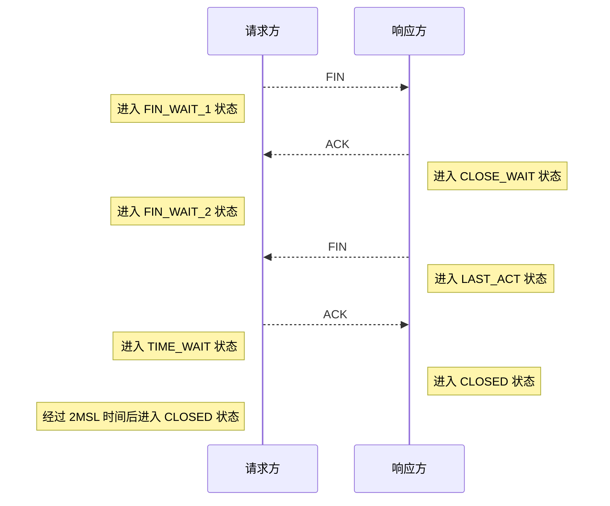

# TCP

TCP(传输控制协议)是一种面向连接的、可靠的、据域字节流的传输层通信协议

## 头部信息

- source port: 16 位
- destination port: 16 位
- sequence number: 32 位，发生数据包中第一个字节的序列号
- acknowledgment number: 32 位，确认序列号
- date offset: 4 位，数据偏移，值=TCP 首部长度/4
- 标志位: 6 位
  - ACK: 表示 acknowledgment number 字段有意义
  - PSH: 表示 Push 功能
  - RST: 表示复位 TCP 连接
  - SYN: 表示 SYN 报文
  - FIN: 表示没有数据需要发送
- window size: 16 位，表示接收缓存区的空闲空间
- checksum: 16 位，校验和
- urgent pointers: 16 位，紧急指针

## 状态控制

TCP 是面向连接的通信协议，在建立连接和终止连接时采用了三次握手和四次挥手的机制

### 三次握手

三次握手是请求方向响应方建立 TCP 连接的过程

过程描述

1. 请求方发送 SYN(seq=x) 报文给响应方，进入 SYN_SEND 状态
2. 响应方接收 SYN 报文，返回 SYN(seq=y)+ACK(ack=x+1) 报文，进入 SYN_RECV 状态
3. 请求方接收 SYN+ACK 报文，返回 ACK(ack=y+1) 报文，进入 ESTABLISHED 状态

### 四次挥手

四次挥手是请求方向响应方断开 TCP 连接的过程

过程描述

1. 请求方数据发送完毕，发送 FIN 报文请求断开连接 (请求方可以接收数据)
2. 响应方接收 FIN 报文，发送 ACK 报文，进入 CLOSE_WAIT 状态 (响应方可以发送数据)
3. 响应方数据发送完毕，发送 FIN 报文表示数据发送完毕，进入 LAST_ACT 状态
4. 请求方接收 FIN 报文，发送 ACK 报文，进入 TIME_WAIT 状态
   - 响应方接收 ACK 报文后进入 CLOSED 状态
   - 请求方经过 2MSL(最大生存期) 后若未接收到响应端请求，则进入 CLOSED 状态

说明：第二次和第三次挥手可以合并发送

## 传输控制

### 超时重传

超时重传(ARQ)机制用于确保数据正确送达，在发送报文段时会开启定时器并保留副本等待响应端回应

- 若在定时器时间内接收响应则取消定时器并删除副本
- 若发生超时，则重新发送报文直到成功

重传超时时间(RTO)一般大于一个 RTT 的平均时间，由于传输距离与传输负载在传输时的差异，RTO 的设计通常采用自适应算法以适应不同的网络

建议 RTO = RTT~s~ + 4 × RTT~d~

- RTT~s~: 加权平均往返时间
- RTT~d~: 偏差的加权平均值

### 滑动窗口

滑动窗口是一种流量控制技术，用于解决网络拥塞状态下的传输问题 

#### 工作流程

窗口机制：在任意时刻，发送方与接收方各维持了一个连续的允许发送或接收帧的序号，称为发送窗口与接收窗口，发送窗口与接收窗口的需靠上下界和大小都可不同。

发送窗口按序号发送帧，发送窗口内若全部帧处于待确认状态则停止发送； 
接收窗口按序号接收帧，接收后发送确认帧并向后滑动窗口 
发送窗口接收到确认信息，从重发表删除对应帧并向后滑动窗口  

#### 相关协议

根据滑动窗口尺寸分为以下三种协议

- 停等协议：当发送窗口与接收擦黄口大小固定为 1 时，滑动窗口协议退化为停等协议
  - 发送窗口=1；接收窗口=1
  - 需要不停的等待应答帧，信道利用率低
- 后退 n 协议：发送方会连续发送若干数据帧，并对每个数据帧设置超时定时器，超时后将重发超时帧及后续帧
  - 发送窗口>1；接收窗口=1
  - 重传时需要重传错误帧及后续帧，在误码率较大场景下，传输效率依旧不高
- 选择重传协议：接收方对于错误帧后续的正确帧进行缓存并要求重传错误帧
  - 发送窗口>1；接收窗口>1
  - 减少了重发浪费，具有较高的传输效率，但要求接收方具有足够的缓冲空间

#### 窗口大小

TCP 连接阶段，双方协商窗口尺寸同时接收方预留数据缓存区 

### 拥塞控制

网络拥塞是网络中某一资源的需求超过了该资源所能提供的可用部分造成网络性能变差的情况  
TCP 使用多种拥塞控制策略避免雪崩式拥塞

- 为每条连接维护一个 拥塞窗口 限制端到端传输的未确认分组总理
- 在连接初始化或超时后使用 慢启动 机制增加 拥塞窗口 的大小

#### 核心概念

拥塞窗口(cwnd)，由发送方维护，用于控制每次发送数据包的大小 
最大分段大小(MSS，IPv4 为 536 字节，IPv6 为 1220 字节)，这里表示拥塞窗口大小的单位 
慢启动门限(ssthresh)，拥塞窗口的最大值  

#### 算法流程

1. 慢启动阶段：设置 cwnd 初值为 1/2/4/10 个 MSS，每次接收到确认包时翻倍增加，直至达到 ssthresh 或丢包等。
2. 拥塞避免阶段：采用线增积减(AIMD)的反馈机制控制 cwnd 大小。cwnd 达到 ssthresh 时，若网络良好，每经过一个 RTT，cwnd 与 ssthresh += 1MSS；若网络拥塞(超时)，则 ssthresh 减半，cwnd 置 1MSS，进入慢启动阶段。
3. 快速重传机制：TCP 在发送报文段时会开启超时计时器，当发送方收到 4 次相同的分段确认(假设重复阈值 3 次)，则认为可能出现丢包状态，发送方忽略超时计时器并立即重发，进入快速恢复阶段
4. 快速恢复阶段：发送方将 cwnd 与 ssthresh 减半，随后进入拥塞避免阶段

